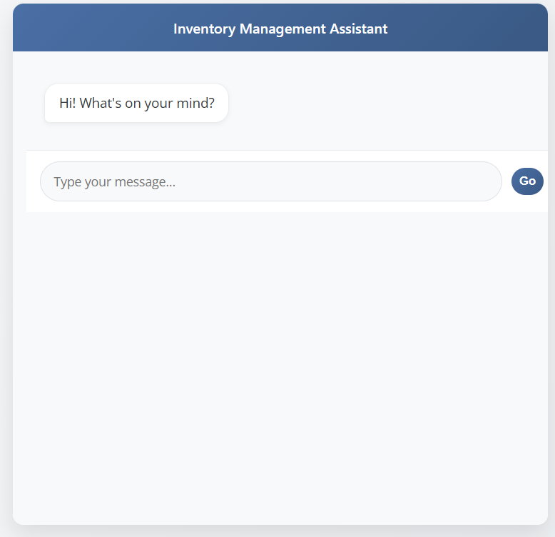
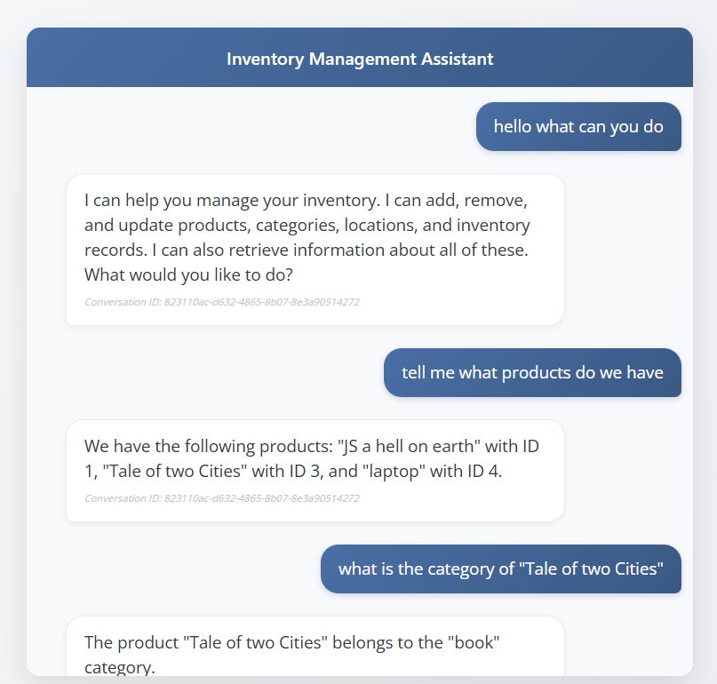

# 🛍️ Inventory Management Chatbot
This project is a full-stack AI-powered chatbot designed to help small businesses manage their inventory through natural language interaction. Users can add items, update stock levels, and view inventory status simply by chatting with the bot—no technical expertise required.
## Project setup

```bash
$ npm install
```
## Add your .env file

Create a `.env` file in the root directory of the project and add the following environment variables.
DB_USERNAME=<your_db_username>
DB_PASSWORD=<your_db_password>
DB_HOST=<your_db_host>
DB_PORT=<your_db_port>
DB_DATABASE=<your_db_name>
GEMINI_API=<your_gemini_api_key>

## Compile and run the project

```bash
# development
$ npm run start

# watch mode
$ npm run start:dev

# production mode
$ npm run start:prod
```
then open the `index.html` file in your browser.

## Available commands in the chat

create, update, delete and list any of the following:

- locations
- categories
- products
- inventory



